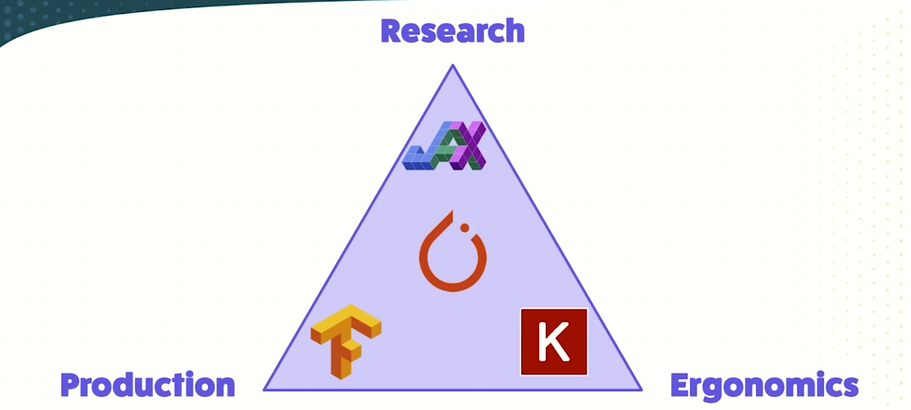

  

# PyTorch 

PyTorch has emerged as a dominant framework in deep learning due to its "neural network pseudocode" API, which closely maps mathematical architectures to programmable Python code. Its success is built upon two primary technical pillars: effortless automatic differentiation and transparent computation on hardware accelerators (GPUs).

This briefing outlines the PyTorch "layer cake" ecosystem, its competitive positioning within the "Deep Learning Software Trilemma," and the fundamental mechanics of tensors—the core data structure of the framework. Key takeaways include:

- **The Goldilocks Framework:** PyTorch occupies a unique middle ground between research flexibility (JAX), production stability (TensorFlow), and developer ergonomics (Keras).
- **Ecosystem Interoperability:** Through partnerships with organizations like HuggingFace, PyTorch provides the infrastructure for the current explosion in generative AI research and deployment.
- **Hardware Agnosticism:** While originating with NVIDIA’s CUDA, PyTorch now supports a diverse array of backends, including Apple Silicon, AMD GPUs, and Google’s TPUs (XLA).
- **Tensor Logic:** Tensors in PyTorch function as multidimensional arrays that mirror NumPy semantics but offer the critical advantage of hardware acceleration and gradient tracking.

  

## 1. The PyTorch Philosophy and Core Capabilities

PyTorch is designed to make deep learning as accessible as possible by providing an API that mirrors the mathematical side of building neural networks. This approach allows researchers to transition from theory to implementation with minimal friction.

### Key Functional Pillars

- **Automatic Differentiation (Autograd):** A technique to automatically compute derivatives and gradients required for the neural network learning process.
- **GPU Acceleration:** Transparent execution on device accelerators (originally NVIDIA CUDA) which has enabled the modern deep learning research explosion.
- **Research-to-Production Pipeline:** While flexible enough for "impatient" prototyping, it provides the necessary modules for scaling to large-scale industrial applications.

--------------------------------------------------------------------------------

## 2. The "Layer Cake" Ecosystem

PyTorch is not merely a single library but a "library of libraries" structured in layers that interface between high-level applications and low-level hardware.

### The Core Layers

|   |   |   |
|---|---|---|
|Layer|Components|Description|
|**High-Level Libraries**|Torchvision, Torchtext, Torchaudio|Specialized libraries for specific data domains.|
|**Production/Deployment**|Torchserve|Specialized tools for productionizing algorithms.|
|**PyTorch Core**|`torch.nn`, `autograd`|The middle layer containing layers, losses, and differentiation logic.|
|**Backends**|CUDA, Apple Silicon, XLA, CPU|The hardware that actually executes the code.|

### The Community and Third-Party Extensions

- **HuggingFace:** The "stewards" of the generative AI community. Their `transformers` and `diffusers` libraries are built on PyTorch core and serve as the go-to implementations for the latest large language models and generative architectures.
- **PyTorch Lightning:** A high-level abstraction that removes boilerplate code, offering an "opinionated" API for building models.
- **Fast.ai:** A beginner-friendly library and educational resource that acts as a stepping stone into the ecosystem.
- **Pyro:** A library for Bayesian machine learning and probabilistic programming.

--------------------------------------------------------------------------------

## 3. The Deep Learning Software Trilemma

When selecting a framework, developers face a trilemma involving three competing priorities: **Productionizability**, **Developer Ergonomics**, and **Research Flexibility**.

### Competitive Landscape

- **JAX:** A "next-gen" library out of Google. It is highly flexible and close to pure NumPy semantics but has a steeper learning curve and is positioned primarily for research.
- **TensorFlow:** Historically the dominant library, specifically optimized for production and data centers, but often criticized for being less ergonomic/harder to use.
- **Keras:** The leader in ergonomics. Keras 3.0 is notable for being "backend agnostic," meaning it can run on JAX, PyTorch, or TensorFlow.
- **PyTorch:** Positioned in the "Goldilocks zone." It is developer-friendly, flexible enough for cutting-edge research, and possesses a clear path to deployment.

--------------------------------------------------------------------------------

## 4. Technical Fundamentals: Tensors in Practice

Tensors are the fundamental data structures in PyTorch. While mathematically complex, in code they are treated as multidimensional arrays.

### Rank, Shape, and Dimension

There is frequent terminological overlap regarding tensor structure. The following table clarifies these distinctions based on PyTorch logic:

|                 |                                                              |                                                           |
| --------------- | ------------------------------------------------------------ | --------------------------------------------------------- |
| Term            | Definition                                                   | Example                                                   |
| **Rank (ndim)** | The number of axes/indices required to identify an element.  | A scalar is Rank 0; a matrix is Rank 2; a cube is Rank 3. |
| **Shape**       | A list representing the size of each axis/dimension.         | A shape of `[3, 4, 5]` indicates 3 matrices of 4x5.       |
| **Dimension**   | Often used as a synonym for "axis" or the size of that axis. | "Dimension 0" might have a size of 32.                    |

### Key Tensor Operations

- **Generation:** `torch.arange()` creates a linear sequence of numbers, similar to Python's `range`.
- **Reshaping:** `.reshape()` rearranges existing elements into a new geometry without changing the data (e.g., turning a 1D array of 60 elements into a 3D "cube" of `3x4x5`).
- **Inspection:** `.shape` is the primary tool for debugging, ensuring compatibility for matrix multiplications and dot products.
- **Interoperability:** The `.numpy()` method allows for transparent conversion between PyTorch tensors and NumPy arrays, facilitating use with the broader scientific Python ecosystem (e.g., for plotting and visualization).

--------------------------------------------------------------------------------

## 5. Hardware Interoperability and Deployment

A defining feature of PyTorch is its ability to run the same code across various hardware backends with minimal changes.

- **Cross-Platform Support:** Code developed on Apple Silicon (MPS) can be scaled up to NVIDIA GPUs (CUDA) or Google Cloud TPUs (XLA) for large-scale training.
- **CPU Fallback:** For educational purposes or environments without specialized hardware, PyTorch maintains full functionality on standard CPUs.
- **C++ API:** While the Python API is standard, a C++ API exists for embedded systems or environments where a Python interpreter cannot be supported.

## Conclusion

PyTorch serves as the "glue" between mathematical theory and hardware execution. By balancing ease of use with professional-grade flexibility, it has become the standard for both the research community (through implementations like HuggingFace) and developers looking to deploy modern AI applications. For simple linear regression, traditional tools like Scikit-learn may suffice, but for accelerated deep learning and generative modeling, PyTorch is the industry-standard tool for the job.